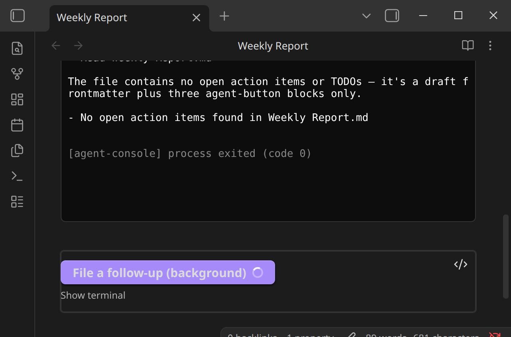

# Completion Modes

`completion:` controls when the button's spinner clears — which is a separate thing from whether the underlying agent session is still alive.

## `manual` (default)

The button stays in its loading state until the terminal session is closed, either by hand (closing the terminal, or the note itself, which sends the session `SIGINT`) or via the small checkmark button that appears to the right of the main button whenever a run is live under this mode. Clicking it kills the session and returns the button to idle.

This is the safest default: nothing decides "the agent is done" on your behalf.

## `responseEnd`

The button's loading state clears automatically as soon as the agent finishes responding, *without* killing the underlying session — it keeps running in the background until the note is closed or it's killed some other way.

This is heuristic: the plugin watches the rendered terminal for Claude Code's own turn-completion marker (a line like `Crunched for 7s · done 2:54 PM`) and clears the spinner when it sees one. If the agent is instead showing a dialog or question it's blocked on — a permission prompt, a "yes/no" confirmation — the spinner is swapped for a ✏️ icon instead of clearing, so a run that's actually waiting on you doesn't silently look finished.

!!! warning "Tuned against Claude Code, not verified against OpenCode"
    This detection pattern-matches text Claude Code has been observed to print. OpenCode's basic command shape is verified (see [Agents and Models](../agents/overview.md)), but its `responseEnd` completion markers, dialog phrasing, or whether it uses the same conventions at all, haven't been separately checked. Treat OpenCode runs with `completion: responseEnd` as a test until that's confirmed.

## Example: `responseEnd` with a hidden terminal

A common pairing — run in the background, don't show the terminal, capture the result into the note once it's done:

````markdown
```agent-button
text: File a follow-up (background)
prompt: Check {{file.path}} for anything marked TODO and list them.
agent: ClaudeCode
agentOutput: file
append: belowButton
showTerminal: false
completion: responseEnd
```
````

Clicking it shows only the button going into its loading state — no terminal pops open:



Note that with `agentOutput: file`, the write only happens once the *process* exits — not just once the turn completes. Under `responseEnd` the session is deliberately kept alive in the background after the spinner clears, so the file write happens later, whenever that session is eventually closed (navigating away from the note, closing it, or the vault closing). See [Captured File Output](file-output.md).
