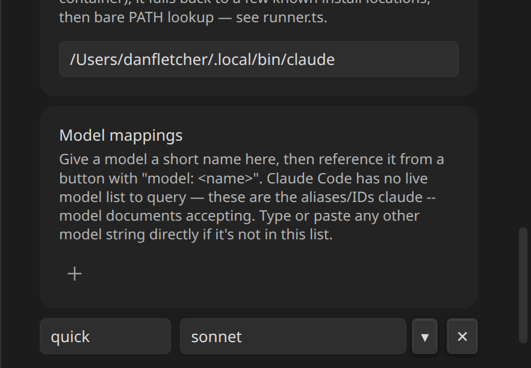
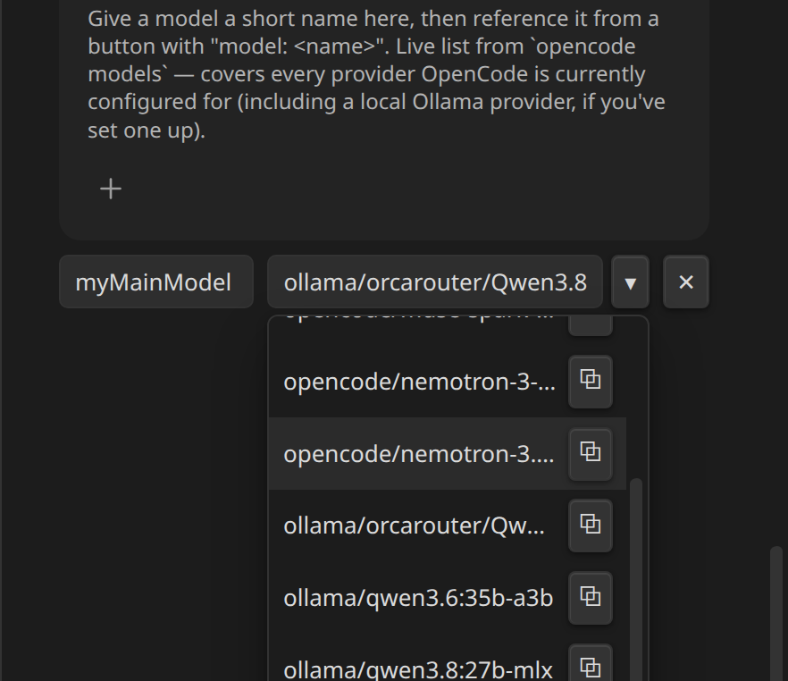

# Settings Reference

Gear icon → **Inline Agents**.

## Plugin-wide

| Setting | Default | |
|---|---|---|
| **Default Agent** | Claude Code | Which CLI agent note buttons run when they don't specify their own `agent:` line. |
| **Auto-approve by default** | Off | When on, buttons run with permission checks bypassed unless a button sets `autoApprove: false`. When off, the agent asks before each tool use, right in the terminal, unless a button sets `autoApprove: true`. |
| **Allow JavaScript expressions in prompts** | Off | Gates `{{= expression }}` segments in `prompt:` templates. Plain `{{ file.basename }}`-style lookups always work regardless of this setting — see [Context and Templating](templating/overview.md). |

## Per provider (Claude Code / OpenCode)

| Setting | | |
|---|---|---|
| **Connection status dot** | green/red next to the provider name | Whether the configured binary actually runs (`<bin> --version` exits `0`) — not an auth check. Refreshed on Settings open and via the ↻ button. |
| **Binary path** | text field | Absolute path to the executable, or a bare command name to rely on `PATH`. Falls back through known install locations and finally `PATH` lookup if the configured path doesn't exist — see [Claude Code and OpenCode](agents/overview.md). |
| **Model mappings** | dynamic list | Name → model string pairs a button's `model:` line resolves against — see [Model Mappings](agents/model-mappings.md). |

OpenCode's model dropdown is a live list from `opencode models`:

## Where each setting lives in the source

For contributors: the whole tab is `AgentConsoleSettingTab` in `src/settings.ts`, using the classic imperative `display()` API rather than the declarative `getSettingDefinitions()` one — the model-mapping list (dynamically added/removed rows, a custom dropdown with a per-option copy button, live status dots) needs DOM control the declarative control types can't express. One trade-off: this tab doesn't appear in Obsidian's own in-app settings search.
