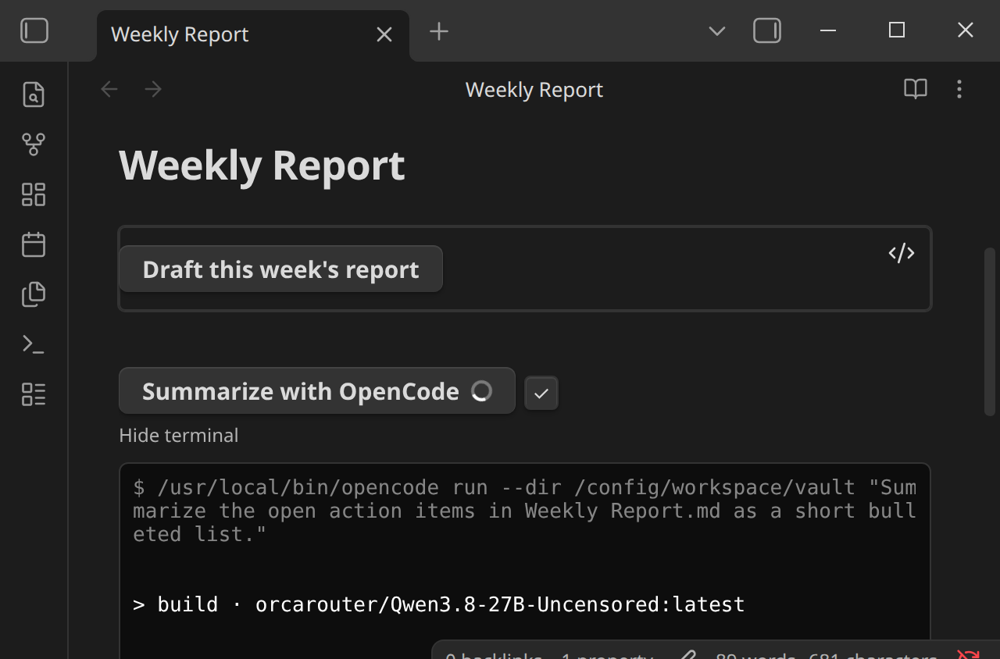
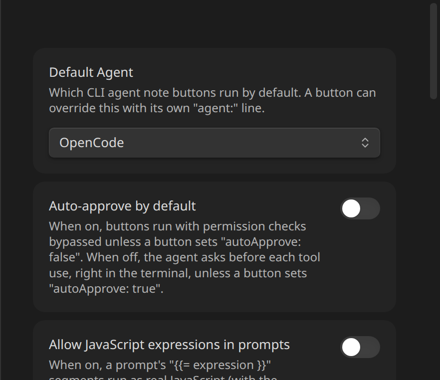

# Lookups and Expressions

`prompt:` isn't just a static string — it's a template rendered against a snapshot of the note the button lives in, taken at click time. Two tiers:

## `{{ path.to.value }}` — plain lookups, always available

Dot-path access into the [context object](context-reference.md). An unknown *root* name (e.g. a typo like `{{flie.basename}}`) is left in the prompt untouched, so the mistake stays visible rather than silently vanishing; a missing value under a *known* root (e.g. no frontmatter, or a field that isn't set) renders as an empty string.

Real example — a button using `{{file.path}}`, and the exact command it produced:



Notice `{{file.path}}` was already substituted with the note's actual path by the time the command reached the terminal — the terminal echo shows the *rendered* prompt, not the template.

## `{{= expression }}` — a small expression language, opt-in

For anything a plain lookup can't express — conditionals, comparisons, string building — `{{= }}` evaluates a compact expression against the same context, with property access (`file.frontmatter.status`), string/number/boolean literals, `+ - * / %`, comparisons (`== != === !== < <= > >=`), `&& || !`, a ternary (`cond ? a : b`), and a small fixed set of helper functions: `join(arr, sep)`, `upper(s)`, `lower(s)`, `default(val, fallback)`, `includes(collection, item)`, `length(x)`. For example:

```
prompt: {{= file.frontmatter.status === "draft" ? "Finish drafting " + file.basename : "Review " + file.basename }}
```

This is deliberately **not** arbitrary JavaScript via `eval`/`new Function` — Obsidian's own community-plugin lint (`eslint-plugin-obsidianmd`) flags that pattern and its config marks the rule non-suppressible, a hard constraint for anything submitted to the community plugin directory, not a style preference. The plugin ships a small hand-written parser/interpreter instead: no assignment, no loops, no access to anything outside the context object, and a fixed, closed set of callable names — there's no code-execution surface to sandbox because there's no way to reach outside the grammar. It covers the realistic "compute part of a prompt from this note's metadata" use case without that risk.

Because it can run arbitrary-ish logic (however constrained) on every click, `{{= }}` is **off by default** — a button using it does nothing until **Allow JavaScript expressions in prompts** is turned on in Settings → Inline Agents:



While off, a button whose prompt contains `{{= }}` writes a clear error to the terminal and doesn't run, rather than silently sending the literal `{{= ... }}` text to the agent.

## Known limitations

- **Regex-delimited, not brace-matched.** Both `{{= }}` and `{{ }}` are found with a non-greedy match up to the first `}}`, so an expression containing a literal `}}` (most plausibly a nested object/array literal) won't parse correctly. Realistic prompt-building — property access, comparisons, string concatenation, ternaries, the built-in helpers — doesn't hit this.
- **`&&`, `||`, and `? :` always evaluate both sides**, unlike real JS short-circuiting. Harmless in practice — everything in the expression language is a pure, total function of its inputs (property access never throws, and the only callable functions are the fixed pure helpers), so there's no side effect an unused branch could produce — but worth knowing if you were expecting `a || expensiveLookup()` to skip `expensiveLookup()`.

## Next

See the full list of what's available in [Context Reference](context-reference.md).
